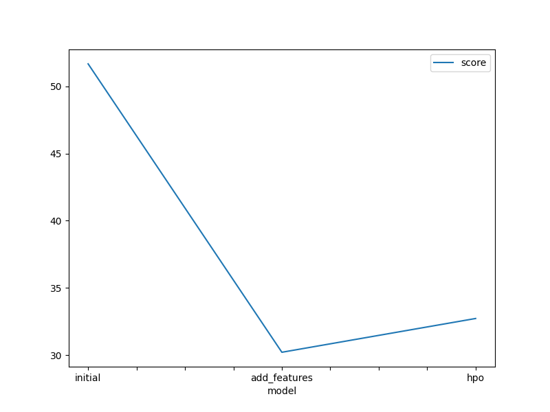
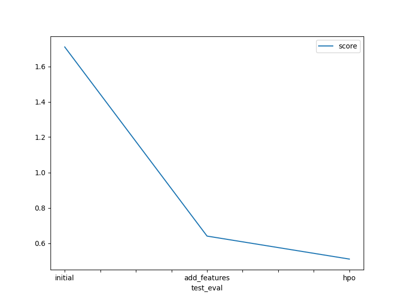

# Report: Predict Bike Sharing Demand with AutoGluon Solution
#### MOUSSA DIALLO

## Initial Training
### What did you realize when you tried to submit your predictions? What changes were needed to the output of the predictor to submit your results?
TODO: When predictions contains negatives values on the target feature the submission fail. It's logic because the number of rented bike couldn't be negative.

### What was the top ranked model that performed?
TODO: At the first try the top 3 models were : Weighted  ensemble model (wich is optional because combine some indivdual model), RandomForest and NeuralFastAI.

## Exploratory data analysis and feature creation
### What did the exploratory analysis find and how did you add additional features?
TODO: When making exploration analysis we found that a lot of variable are to be set categorical like "holiday", "season", "weather" and workingday. Also, after the first modelisation we perform a feature importance analysis and  notice that the feature datetime is the most correlated to the target feature, that's why we create from it some others catégoricals variables like hour. Then from the new column 'hour' we create another categorical variable to take account the fact that service hour can affect bike demand so  we add a new column named hour_of_day with three labels : "morning", "evening" and "afternoon".

### How much better did your model preform after adding additional features and why do you think that is?
TODO: The make a big move in termes of performance after adding some features. It goes from 1.71 to 0.64

## Hyper parameter tuning
### How much better did your model preform after trying different hyper parameters?
TODO: Autogluon already make multi stage hyperparameter compared to the default configuration of each model. Every model is training with it's default parameter and others predifned hyparameters like 'GBMlarge' for GBM. When dealing with our hyperparameter search we notice that the score on kaggle change in the postive way :  0.51 (new score) vs 0.64.  but since the space is too large to be explored with limited time and computer ressource we think that it can make more positive change.

### If you were given more time with this dataset, where do you think you would spend more time?
TODO: with more time we can train more different model like fastaiNeuralAI with different hyperparameter like learning_rate number of epoch etc. ALso we can tune hyperparameter of the neural network with torch model.

### Create a table with the models you ran, the hyperparameters modified, and the kaggle score.
|model|hpo1|hpo2|hpo3|score|
|--|--|--|--|--|
|initial|n_estimators|max_depth|max_features|1.34|
|add_features|n_estimators|max_depth|max_features|0.48|
|hpo|n_estimators|max_depth|max_features|0.47|

### Create a line plot showing the top model score for the three (or more) training runs during the project.

TODO: Replace the image below with your own.

### Create a line plot showing the top kaggle score for the three (or more) prediction submissions during the project.

TODO: Replace the image below with your own.

## Summary
TODO: In this project, we collaborated on a Kaggle competition aimed at predicting bike-sharing demand using AutoGluon. This tool is remarkable, empowering machine learning engineers to construct robust models by exploring numerous model candidates and training them collectively to identify the most suitable one for the task. Through feature engineering on the dataset, we observed that adding at least one additional feature could enhance the model's effectiveness. Additionally, we conducted extensive hyperparameter tuning to evaluate various combinations of each model's best arguments. Through hyperparameter optimization, we observed improvements in the Kaggle score. Given more time, we were able to identify the best and most optimal model to deploy, effectively addressing the current problem
